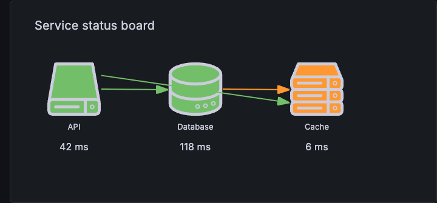
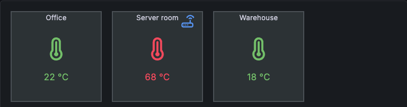
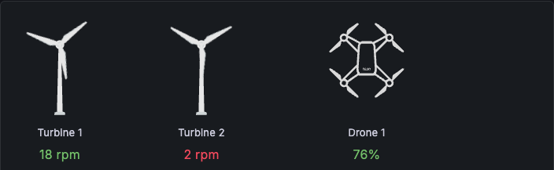
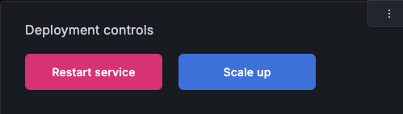

# Canvas panel plugin

[](https://grafana.com/grafana/plugins/grafana-canvas-panel/)
[](https://grafana.com/grafana/plugins/grafana-canvas-panel/)
[](https://github.com/grafana/grafana-canvas-panel/actions/workflows/push.yml)
[](https://github.com/grafana/grafana-canvas-panel/actions/workflows/publish.yml)
[](https://github.com/grafana/grafana-canvas-panel/blob/main/LICENSE)

Draw pictures with the Canvas visualization panel plugin, then paint by numbers with your
Grafana metrics data!



This is the Canvas panel externalized from Grafana core into its own plugin repository. See
[`CODE_MIGRATION_PLAN.md`](./CODE_MIGRATION_PLAN.md) for background on the externalization
effort.

## Showcase

| | |
|---|---|
|  |  |
| Floor plan sensor overlay — rooms as shapes, live data-bound status icons | Turbine and drone fleet monitor — custom elements bound to live data |
|  | |
| Interactive action buttons — Canvas elements can trigger API calls, not just display data | |

The provisioned dashboards behind these screenshots live under
[`provisioning/dashboards/`](./provisioning/dashboards/) (`canvas_showcase*.json`) — run
`npm run server` to load them locally.

## Documentation

- [Canvas panel docs](https://grafana.com/docs/grafana/latest/visualizations/panels-visualizations/visualizations/canvas/) — user-facing documentation on grafana.com
  (source: [`docs/sources/.../canvas/index.md`](https://github.com/grafana/grafana/blob/main/docs/sources/visualizations/panels-visualizations/visualizations/canvas/index.md) in `grafana/grafana`)
- [`src/README.md`](./src/README.md) — the plugin's Grafana.com Catalog-facing README
- [`RUN_EXTERNALIZED_PLUGIN_LOCALLY.md`](./RUN_EXTERNALIZED_PLUGIN_LOCALLY.md) — how to run this
  plugin against a local Grafana core checkout
- [`CODE_MIGRATION_PLAN.md`](./CODE_MIGRATION_PLAN.md) — background on the Canvas-from-core
  externalization effort
- [`provisioning/README.md`](./provisioning/README.md) — provisioning setup notes
- [`CHANGELOG.md`](./CHANGELOG.md) — release history
- [`.config/AGENTS/instructions.md`](./.config/AGENTS/instructions.md) — Grafana plugin-specific
  AI agent guidance

## Getting started

### Frontend

1. Install dependencies

   ```bash
   npm install
   ```

2. Build plugin in development mode and run in watch mode

   ```bash
   npm run dev
   ```

3. Build plugin in production mode

   ```bash
   npm run build
   ```

4. Run the tests (using Jest)

   ```bash
   # Runs the tests and watches for changes, requires git init first
   npm run test

   # Exits after running all the tests
   npm run test:ci
   ```

5. Spin up a Grafana instance and run the plugin inside it (using Docker)

   ```bash
   npm run server
   ```

6. Run the E2E tests (using Playwright)

   ```bash
   # Spins up a Grafana instance first that we tests against
   npm run server

   # If you wish to start a certain Grafana version. If not specified will use latest by default
   GRAFANA_VERSION=11.3.0 npm run server

   # Starts the tests
   npm run e2e
   ```

7. Run the linter

   ```bash
   npm run lint

   # or

   npm run lint:fix
   ```

## Distributing your plugin

When distributing a Grafana plugin either within the community or privately the plugin must be signed so the Grafana application can verify its authenticity. This can be done with the `@grafana/sign-plugin` package.

_Note: It's not necessary to sign a plugin during development. The docker development environment that is scaffolded with `@grafana/create-plugin` caters for running the plugin without a signature._

### Initial steps

Before signing a plugin please read the Grafana [plugin publishing and signing criteria](https://grafana.com/legal/plugins/#plugin-publishing-and-signing-criteria) documentation carefully.

`@grafana/create-plugin` has added the necessary commands and workflows to make signing and distributing a plugin via the grafana plugins catalog as straightforward as possible.

Before signing a plugin for the first time please consult the Grafana [plugin signature levels](https://grafana.com/legal/plugins/#what-are-the-different-classifications-of-plugins) documentation to understand the differences between the types of signature level.

1. Create a [Grafana Cloud account](https://grafana.com/signup).
2. Make sure that the first part of the plugin ID matches the slug of your Grafana Cloud account.
   - _You can find the plugin ID in the `plugin.json` file inside your plugin directory. For example, if your account slug is `acmecorp`, you need to prefix the plugin ID with `acmecorp-`._
3. Create a Grafana Cloud API key with the `PluginPublisher` role.
4. Keep a record of this API key as it will be required for signing a plugin

### Signing a plugin

This repo publishes via the [`publish.yml`](./.github/workflows/publish.yml) workflow (see
[`cd.yml`](https://github.com/grafana/plugin-ci-workflows) for details), which handles signing as
part of the CD pipeline — there's no separate manual signing step or release-tag workflow to run.

## Learn more

Below you can find source code for existing app plugins and other related documentation.

- [Basic panel plugin example](https://github.com/grafana/grafana-plugin-examples/tree/master/examples/panel-basic#readme)
- [`plugin.json` documentation](https://grafana.com/developers/plugin-tools/reference/plugin-json)
- [How to sign a plugin?](https://grafana.com/developers/plugin-tools/publish-a-plugin/sign-a-plugin)
